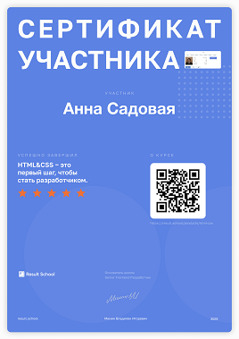

# ANNA SADOVAYA


## Contacts

Location: Astana, Kazakhstan

Discord: Anna Sadovaya(@AnnaS86)

GitHub: AnnaS86

Telegram: @Ancha_New

---

## About Me

I started learning front-end and I really like it.
I have a strong motivation to change my life.

My personal qualities: responsibility, attentiveness, perseverance.
I like to learn something new.

My hobby: traveling to warm countries.

---

## Skills

1. HTML
2. CSS
3. JavaScript (Basic)
4. VS Code
5. GIT, GitHub

---

## Code Example

```
const quarterOf = (month) => {
  if (month <= 3)
  return 1;
   if (month >= 4 && month <= 6)
  return 2;
  if (month >= 7 && month <= 9)
  return 3;
  if (month >= 9)
  return 4
};
```

---

## Experience
[CSS Bayan](https://github.com/AnnaS86/cssBayan/blob/gh-pages/cssBayan/index.html "Project CSS Bayan"). This is an educational project, in which I learned how to make an accordion element and an adaptive layout.

[Git & Markdown](https://annas86.github.io/rsschool-cv/cv "Project CV-1"). This is an educational project where I make my CV by used Markdown.

---

## Education

Some free courses:
* HTML Academy (not finish yet)
* Result School (HTML & CSS)
* Result School (JavaScript marathon)
* ITlogia UX/UI Start (Figma Basic)

   

---

## Languages
Russian: native

English: A2. I have some speaking practice when I am abroad.


